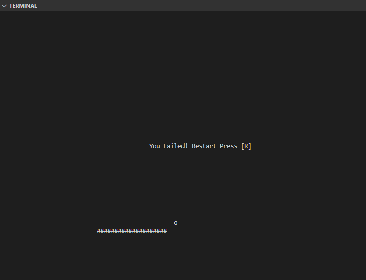

unix programming in c++
=======================

unix command program implement
-----------------
* [more](src/more)
* [who](src/who)
* [cp](src/cp)
* [tty](src/tty)
    - `tcgetattr,tcsetattr,termios`
* [ls](src/ls)
* [pwd](src/pwd)
* [tty write](src/write)
* [bounce2d game](src/game)
